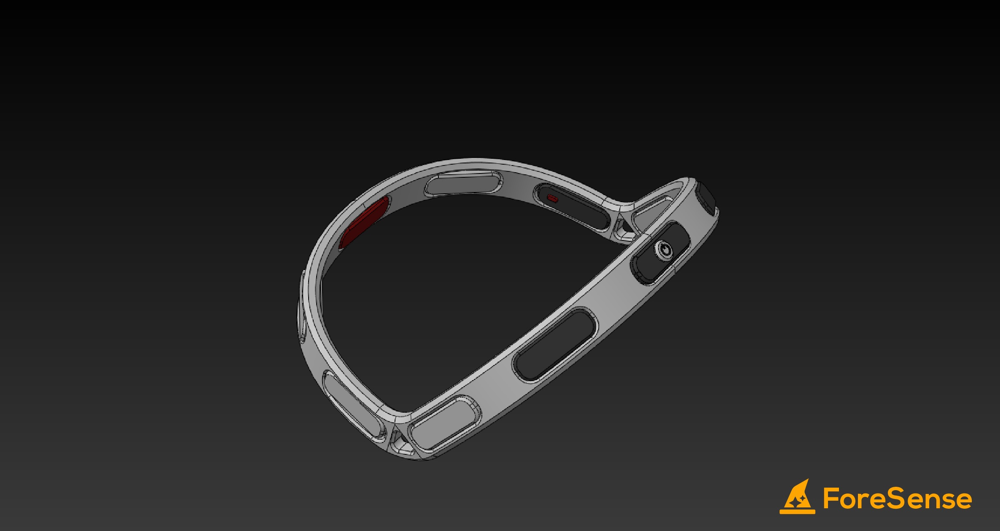

# choochoochagachaga
> Submission for SCDF X IBM Lifesavers' Innovation Challenge: Call for Code 2020

ForeSense is a highly modular wearable that pipes essential data such as heart-rate & temperature to IBM cloud for analysis and is displayed in an intuitive interface for commanders to push each trainee to his/her max.

Checkout our dashboard [here](https://quantumxt.github.io/choochoochagachaga)!

# License
Licensed under the [BSD 3-Clause "New" or "Revised" License](./LICENSE).
